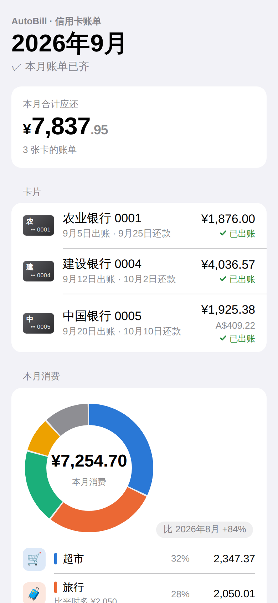
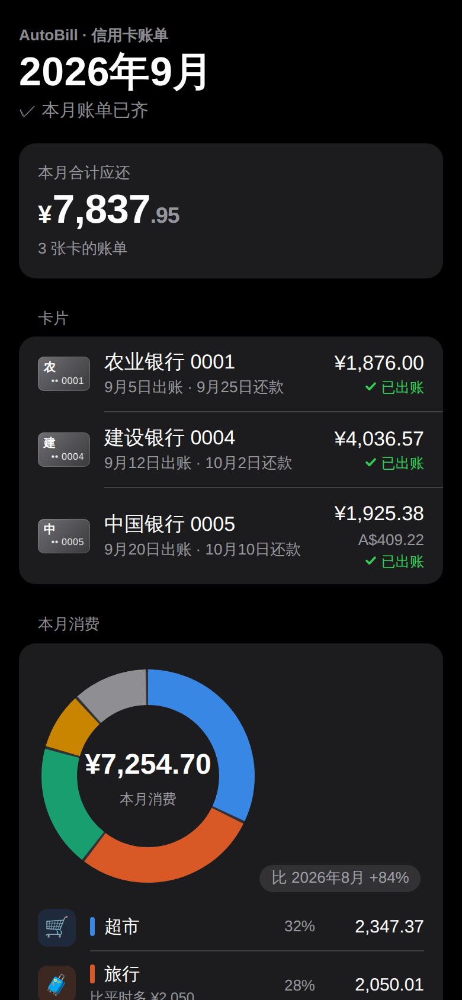
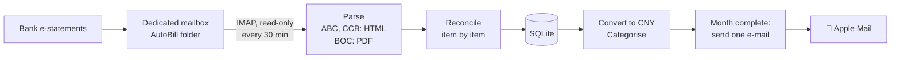
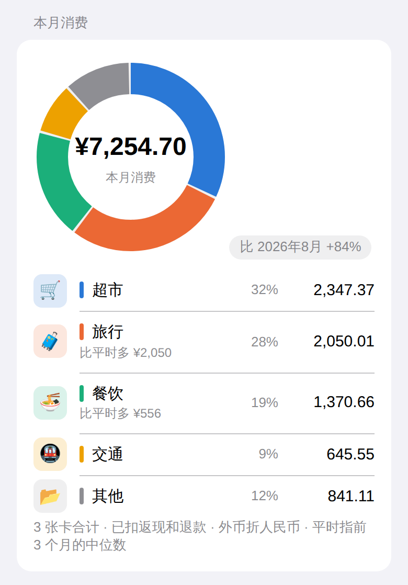
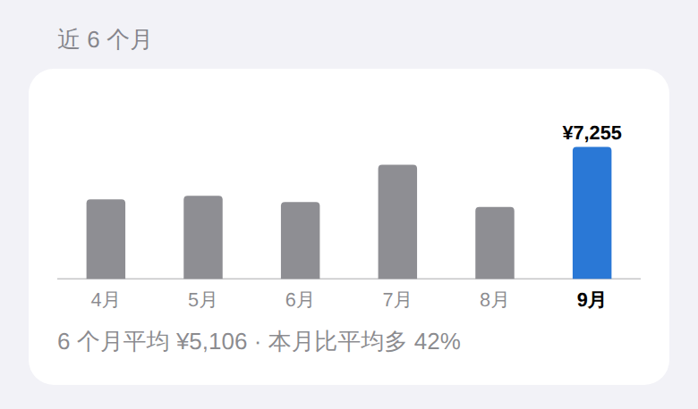
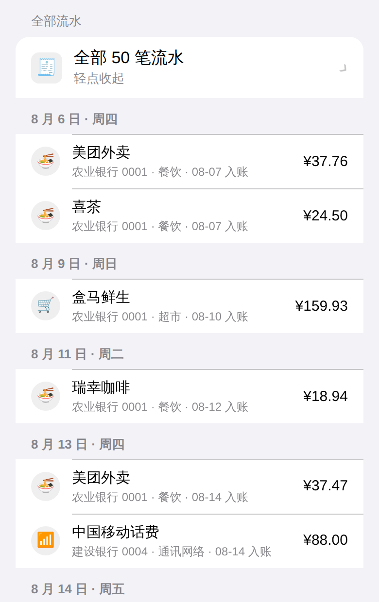
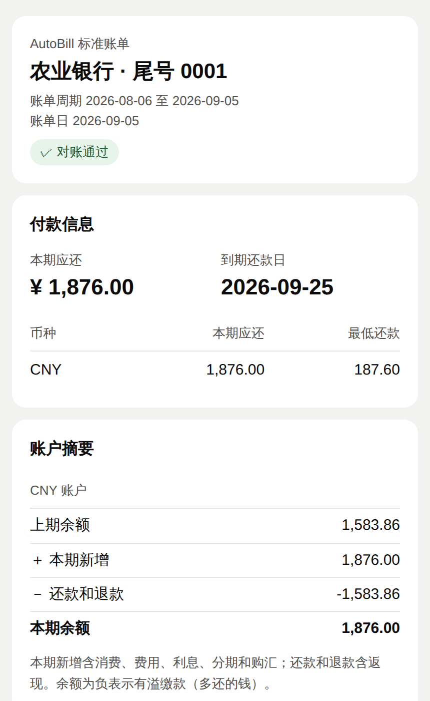

# AutoBill

[](https://github.com/YangMingUNSW/autobill/actions/workflows/ci.yml)
[](https://github.com/YangMingUNSW/autobill/actions/workflows/docker.yml)

[](LICENSE)

English | [简体中文](README.zh-CN.md)

Self-hosted, rule-based summaries of Chinese credit-card statements. AutoBill reads the e-statements your banks send to a dedicated mailbox, reconciles every statement against the bank's own totals, and sends you one clean e-mail per month, designed for Apple Mail on iPhone. Your data never leaves your own server and mailbox.

<p align="center">
  
  &nbsp;&nbsp;
  
</p>
<p align="center"><sub>Screenshots use invented demo data (<a href="scripts/demo_screenshots.py">scripts/demo_screenshots.py</a>). The e-mail is in Simplified Chinese, for its intended users in mainland China.</sub></p>

> **Status:** `v0.2.0` runs every 30 minutes in Docker on the author's own server: parsing and reconciliation for three banks, one e-mail per statement month, alert e-mails, and optional AI categorisation of merchants the rules miss. See the [roadmap](project.md#6-分期路线) (Chinese).

## Features
- **Deterministic parsing.** Every statement is parsed with fixed rules, never AI, and checked item by item against the totals the bank prints on it. Any mismatch is reported, never silently ignored.
- **One e-mail per statement month.** Sent once every expected card has issued its statement, so you get one complete picture instead of one e-mail per card.
- **Multi-currency.** Original currencies are kept and converted to CNY at the exchange rate of the statement e-mail's date ([Frankfurter](https://frankfurter.dev)).
- **Categories.** Keyword rules first; merchants the rules miss can optionally be categorised by an AI endpoint you configure, which only ever sees merchant name, location and currency.
- **Read-only mailbox.** Messages are never deleted, moved or marked as read.
- **Alerts.** An unrecognised e-mail, a statement that fails to parse, a new card or a mailbox login failure sends one alert, never repeated.
- **Backups.** Each monthly e-mail carries a compressed copy of the database.

## How it works


## What the e-mail shows
<table>
  <tr>
    <td width="50%" valign="top">
      
      <p><b>Spending</b> by category with month-over-month change. A category clearly off its usual level (the median of the previous three months) gets a quiet note, whether up or down.</p>
    </td>
    <td width="50%" valign="top">
      
      <p><b>Last six months</b>: one column per statement month, the current month highlighted, with the average.</p>
      
      <p><b>All transactions</b> from every card in one list by day, collapsed until tapped. Foreign purchases show the local currency first, with the CNY equivalent.</p>
    </td>
  </tr>
</table>

The e-mail also lists each card's statement date, due date and amount due (foreign-currency cards in both currencies) and the top merchants. Due dates are shown; payment reminders are deliberately out of scope.

## Supported banks
| Bank | Statement format | Status |
|---|---|---|
| Agricultural Bank of China (ABC) | HTML e-mail | ✅ Supported |
| China Construction Bank (CCB) | HTML e-mail | ✅ Supported (spending rows need more samples) |
| Bank of China (BOC) | PDF attachment | ✅ Supported, including combined multi-card statements |

## Quick start (Docker)
All the server needs is Docker:

```bash
mkdir -p autobill/data && cd autobill
curl -fsSLO https://raw.githubusercontent.com/YangMingUNSW/autobill/main/compose.yaml
curl -fsSL https://raw.githubusercontent.com/YangMingUNSW/autobill/main/config.example.yaml -o data/config.yaml
curl -fsSL https://raw.githubusercontent.com/YangMingUNSW/autobill/main/autobill.env.example -o autobill.env
# Fill in data/config.yaml and autobill.env (mailbox password), then:
docker compose run --rm autobill check-mailbox
docker compose up -d
```

Multi-arch images (`linux/amd64`, `linux/arm64`) are published to `ghcr.io/yangmingunsw/autobill`, so it runs on a VPS, a NAS or an Apple silicon Mac. Full setup, mailbox configuration and everyday commands: [docs/deploy.md](docs/deploy.md) and [docs/setup.md](docs/setup.md) (Chinese).

## Try it locally (no mailbox needed)
Requires [uv](https://docs.astral.sh/uv/) and Git. Uses the anonymised sample statements in this repository:

```powershell
git clone https://github.com/YangMingUNSW/autobill.git
cd autobill
$env:AUTOBILL_DATA_DIR = "$env:TEMP\autobill-dev"      # scratch data directory
uv run autobill import-dir tests/fixtures --no-send    # import the samples
uv run autobill preview-email --cycle 2026-09          # render September's e-mail to HTML
uv run autobill report --month 2026-08                 # print August's summary
```

An optional `autobill statement` command renders every statement in one uniform layout as HTML and PDF (requires Edge or Chrome).

<p align="center"></p>

## Documentation
| Path | Contents |
|---|---|
| [project.md](project.md) | Overview, scope, decisions, architecture, risks |
| [docs/](docs/) | Module design, bank statement format specs, development process, setup guide |
| [tests/fixtures/](tests/fixtures/README.md) | The author's real statements, anonymised (identity data removed) |
| [CHANGELOG.md](CHANGELOG.md) | Release notes |
| [CLAUDE.md](CLAUDE.md) | Rules for AI coding assistants working on this repository |

Design documents are written in Simplified Chinese; code, comments and commit messages are in English.

## Contributing
Issues and pull requests are welcome. Please read [docs/development.md](docs/development.md) (Chinese) for the workflow and testing conventions: one change per pull request, and CI must pass.

## Security
Please report vulnerabilities privately as described in [SECURITY.md](SECURITY.md). Do not open a public issue.

## License
[MIT](LICENSE) © Larry Row
