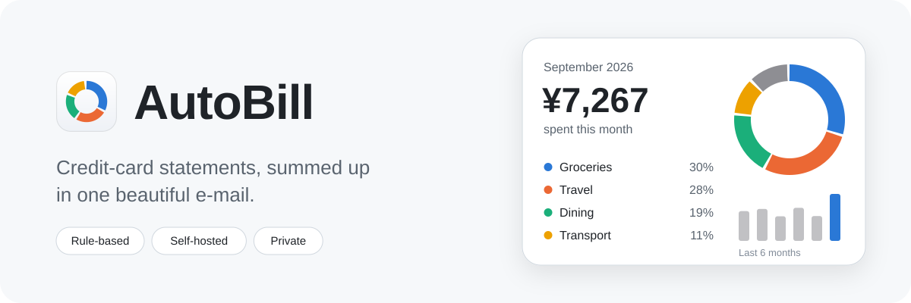
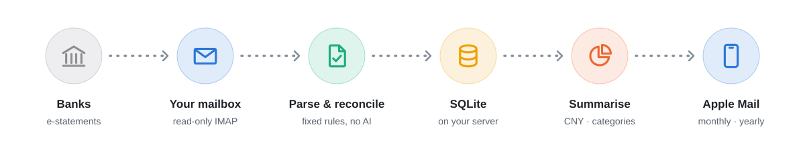

<!-- Pictures: scripts/readme_art.py (banner, pipeline) and scripts/demo_screenshots.py
     (animations, screenshots), all from invented data. See docs/development.md. -->
<picture>
  <source media="(prefers-color-scheme: dark)" srcset="docs/images/banner-dark.svg">
  
</picture>

<p align="center">
  <a href="https://github.com/YangMingUNSW/autobill/actions/workflows/ci.yml"></a>
  <a href="https://github.com/YangMingUNSW/autobill/releases"></a>
  
  <a href="LICENSE"></a>
</p>

<p align="center"><b>English</b> · <a href="README.zh-CN.md">简体中文</a></p>

AutoBill reads the credit-card e-statements that Chinese banks (ABC, CCB, BOC and ICBC) send to a dedicated mailbox, parses them with fixed rules, reconciles every statement against the bank's own totals, and sends you one clean e-mail per statement month, plus a year in review each January, designed for Apple Mail on iPhone. Your statements and the database stay on your own server; the little that goes out is listed under [Privacy](#privacy).

<table>
  <tr>
    <td width="50%" align="center" valign="top">
      <picture>
        <source media="(prefers-color-scheme: dark)" srcset="docs/images/demo-month-dark.webp">
        
      </picture>
      <br><sub><b>The month</b> · tap a category to see every purchase</sub>
    </td>
    <td width="50%" align="center" valign="top">
      <picture>
        <source media="(prefers-color-scheme: dark)" srcset="docs/images/demo-year-dark.webp">
        
      </picture>
      <br><sub><b>The year</b> · pick a category, then a month</sub>
    </td>
  </tr>
</table>

<p align="center"><sub>Invented demo data. The e-mails are in Simplified Chinese, like the statements they summarise.</sub></p>

> [!NOTE]
> **Status:** in daily use, running in Docker every 30 minutes. Four banks are supported, with one e-mail per statement month, the year in review, alert e-mails and optional AI categorisation of merchants the rules miss. The latest release is `v0.3.0`; what has landed since is in the [changelog](CHANGELOG.md), and the [roadmap](docs/project.md#6-分期路线) is in Chinese.

## Contents
- [Features](#features)
- [What the e-mails show](#what-the-e-mails-show)
- [How it works](#how-it-works)
- [Privacy](#privacy)
- [Supported banks](#supported-banks)
- [Getting started](#getting-started)
- [Documentation](#documentation)
- [FAQ](#faq)
- [Contributing](#contributing) · [Security](#security) · [Acknowledgements](#acknowledgements) · [License](#license)

## Features
- **Deterministic parsing.** Every statement is parsed with fixed rules, never AI, and checked item by item against the totals the bank prints on it. Any mismatch is reported, never silently ignored. After an update that changes a parser, the statements already stored are read again automatically.
- **One e-mail per statement month.** Sent once every expected card has issued its statement, so you get one complete picture instead of one e-mail per card. It reads as a bill: the dates its spending covers are under the title, while the year in review counts each purchase by its own date.
- **Tap for details.** Categories, top merchants and the transaction list open in place, and the year in review filters by month and category. It is all CSS, with no scripts and nothing loaded from the web, so it works in Apple Mail, and offline once the e-mail has downloaded.
- **Multi-currency.** Original currencies are kept and converted to CNY at the exchange rate of the statement e-mail's date ([Frankfurter](https://frankfurter.dev)).
- **Categories.** Keyword rules first; merchants the rules miss can optionally be categorised by an AI endpoint you configure, which only ever sees merchant name, location and currency.
- **Read-only mailbox.** Messages are never deleted, moved or marked as read.
- **Alerts.** An unrecognised e-mail, a statement that fails to parse, a new card or a mailbox login failure sends one alert, never repeated.
- **Backups.** Each monthly e-mail carries a compressed copy of the database.
- **Year in review.** Once a year, when January's statements have brought in December's spending, one e-mail sums up the calendar year in the same style: a column per month, categories, top merchants, the shops you go back to, the currencies you paid in and each card. `autobill year-review` previews it any time.

## What the e-mails show
<table>
  <tr>
    <td width="50%" valign="top">
      
      <p><b>Spending</b> by category, compared with the previous statement. A category clearly off its usual level (the median of the previous three statements) gets a quiet note, whether up or down. Tap a category, or one of the top merchants, to see every purchase behind it.</p>
    </td>
    <td width="50%" valign="top">
      
      <p><b>Last six statements</b>: one column per statement month with its amount, the current one highlighted, and the average.</p>
      
      <p><b>All transactions</b> from every card in one list by day, collapsed until tapped. Foreign purchases show the local currency first, with the CNY equivalent.</p>
    </td>
  </tr>
</table>

The e-mail opens with the total due, the dates the statements' spending covers, and each card's statement date, due date and amount due (foreign-currency cards in both currencies), and ends with the top merchants. Due dates are shown; payment reminders are deliberately out of scope.

<details>
<summary><b>More screenshots</b>: the first screen in light and dark, the year in review, a standard statement</summary>
<br>
<p align="center">
  
  &nbsp;
  
  &nbsp;
  
</p>
<p align="center"></p>
<p align="center"><sub>The optional <code>autobill statement</code> command renders every statement in one uniform layout as HTML and PDF.</sub></p>
</details>

## How it works
<picture>
  <source media="(prefers-color-scheme: dark)" srcset="docs/images/pipeline-dark.svg">
  
</picture>

Every 30 minutes AutoBill reads the new statements in the mailbox folder, parses and reconciles them, and stores them in SQLite. Once every card expected for a month has issued its statement (or a week after the last one was due), it sends that month's e-mail; a statement that arrives later is sent in a follow-up in the same thread, unless it has nothing on it and nothing to pay.

## Privacy
- **Your mailbox is read-only.** Folders are opened with `EXAMINE` and messages fetched with `BODY.PEEK[]`: nothing is deleted, moved or marked as read.
- **Your data stays on your server.** Statements and the SQLite database live in the data directory. What leaves it are the e-mails to your own mailbox, the monthly one with a backup of the database.
- **Few outbound connections:** your own IMAP and SMTP servers; [Frankfurter](https://frankfurter.dev), which receives a currency code and a date; and, only if you configure one, an AI endpoint that receives merchant name, location and currency, never amounts, dates or card numbers.
- **The e-mails load nothing.** No remote images, no tracking pixels, no scripts.

The full security model is in [SECURITY.md](SECURITY.md).

## Supported banks
| Bank | Statement format | Status |
|---|---|---|
| Agricultural Bank of China (ABC) | HTML e-mail | ✅ Supported |
| China Construction Bank (CCB) | HTML e-mail | ✅ Supported |
| Bank of China (BOC) | PDF attachment | ✅ Supported, including combined multi-card statements |
| Industrial and Commercial Bank of China (ICBC) | HTML e-mail | ✅ Supported, including one account in several currencies |

## Getting started
### Docker
All the server needs is Docker:

```bash
mkdir -p autobill/data && cd autobill
curl -fsSLO https://raw.githubusercontent.com/YangMingUNSW/autobill/main/compose.yaml
curl -fsSL https://raw.githubusercontent.com/YangMingUNSW/autobill/main/config.example.yaml -o data/config.yaml
curl -fsSL https://raw.githubusercontent.com/YangMingUNSW/autobill/main/autobill.env.example -o autobill.env
chmod 600 autobill.env                  # it will hold your mailbox password
printf "AUTOBILL_UID=%s\nAUTOBILL_GID=%s\n" "$(id -u)" "$(id -g)" > .env   # the container runs as you
# Fill in data/config.yaml and autobill.env (mailbox password), then:
docker compose run --rm autobill check-mailbox
docker compose up -d
```

Multi-arch images (`linux/amd64`, `linux/arm64`) are published to `ghcr.io/yangmingunsw/autobill`, so it runs on a VPS, a NAS or an Apple silicon Mac. Full setup, mailbox configuration and everyday commands: [docs/deploy.md](docs/deploy.md) and [docs/setup.md](docs/setup.md) (Chinese).

### Try it locally (no mailbox needed)
Requires [uv](https://docs.astral.sh/uv/) and Git. Uses the anonymised sample statements in this repository:

```bash
git clone https://github.com/YangMingUNSW/autobill.git
cd autobill
export AUTOBILL_DATA_DIR=/tmp/autobill-dev             # a scratch data directory
uv run autobill import-dir tests/fixtures --no-send    # import the samples
uv run autobill preview-email --cycle 2026-09          # September's e-mail as an HTML file
uv run autobill report --month 2026-08                 # August's summary
uv run autobill year-review --year 2026                # the year so far, as text
```

In Windows PowerShell, set the directory with `$env:AUTOBILL_DATA_DIR = "$env:TEMP\autobill-dev"` instead.

## Documentation
| Path | Contents |
|---|---|
| [docs/project.md](docs/project.md) | Overview, scope, decisions, architecture, risks |
| [docs/architecture.md](docs/architecture.md) | Code map: which file does each step, and where to make a change |
| [docs/](docs/README.md) | Module design, bank statement format specs, development process, setup guide |
| [tests/fixtures/](tests/fixtures/README.md) | The author's real statements, anonymised (identity data removed) |
| [CHANGELOG.md](CHANGELOG.md) | Release notes |
| [CLAUDE.md](CLAUDE.md) | Rules for AI coding assistants working on this repository |

Design documents are written in Simplified Chinese; code, comments and commit messages are in English.

## FAQ
<details>
<summary><b>Why an e-mail, and not an app?</b></summary>

An e-mail arrives by itself, stays in your mailbox for good, needs nothing installed and works offline once downloaded. Apple Mail renders it with the same engine as Safari, so it can look and feel like an iOS app. It also works from mainland China: the server does all the fetching and sending, and your phone only has to receive the e-mail (iCloud Mail works there).
</details>

<details>
<summary><b>Does it work in Gmail or Outlook?</b></summary>

The e-mails are designed for Apple Mail on iPhone, and only tested there. Other clients may drop the styles or the parts that open when tapped.
</details>

<details>
<summary><b>Can it read my bank?</b></summary>

Today: Agricultural Bank of China, China Construction Bank, Bank of China and Industrial and Commercial Bank of China. Each bank's statement format is documented in [docs/banks/](docs/banks/README.md) (Chinese), and a new parser needs a few anonymised sample statements. Open an issue first; never attach a real statement.
</details>

<details>
<summary><b>What does the AI see?</b></summary>

Nothing, unless you configure an endpoint. If you do, it only receives the name, location and currency of merchants the keyword rules could not categorise. It never sees amounts, dates or card numbers, and it is never used to parse a statement or compute an amount.
</details>

<details>
<summary><b>What if the server disappears?</b></summary>

Each monthly e-mail carries a compressed copy of the database, so your mailbox is the off-site backup. Restoring it is described in [docs/deploy.md](docs/deploy.md) (Chinese).
</details>

## Contributing
Issues and pull requests are welcome. Please read [CONTRIBUTING.md](CONTRIBUTING.md) first; everyone taking part is expected to follow the [Code of Conduct](CODE_OF_CONDUCT.md).

## Security
Please report vulnerabilities privately as described in [SECURITY.md](SECURITY.md). Do not open a public issue.

## Acknowledgements
- [Frankfurter](https://frankfurter.dev) for free exchange rates, from the European Central Bank's reference rates.
- [pdfplumber](https://github.com/jsvine/pdfplumber), [Beautiful Soup](https://www.crummy.com/software/BeautifulSoup/) and [lxml](https://lxml.de) for reading the statements.
- [Jinja](https://jinja.palletsprojects.com), [Typer](https://typer.tiangolo.com), [Pydantic](https://docs.pydantic.dev) and [uv](https://docs.astral.sh/uv/).
- Apple's [Human Interface Guidelines](https://developer.apple.com/design/human-interface-guidelines/), for the look and feel the e-mails aim at.

## License
[MIT](LICENSE) © Larry Row
