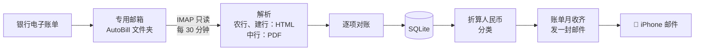

# AutoBill

[](https://github.com/YangMingUNSW/autobill/actions/workflows/ci.yml)
[](https://github.com/YangMingUNSW/autobill/actions/workflows/docker.yml)

[](LICENSE)

[English](README.md) | 简体中文

自部署的信用卡账单汇总工具。AutoBill 读取银行发到专用邮箱的电子账单，用固定规则解析并逐项对账，每个账单月给你发一封为 iPhone 自带邮件 App 排版的汇总邮件。数据只在你自己的服务器和邮箱里。

<p align="center">
  
  &nbsp;&nbsp;
  
</p>
<p align="center"><sub>截图使用编造的演示数据（<a href="scripts/demo_screenshots.py">scripts/demo_screenshots.py</a>），不是任何人的真实账单。</sub></p>

> **开发进度**：`v0.2.0` 在作者自己的服务器上用 Docker 每 30 分钟运行一次：三家银行的解析和对账、每个账单月一封邮件、提醒邮件，以及可选的 AI 商户分类。路线见 [project.md](project.md#6-分期路线)。

## 功能
- **确定性解析**：每份账单都用固定规则解析，不经过 AI；逐项和银行印在账单上的汇总数核对，对不上会明确告诉你差在哪。
- **一个账单月一封邮件**：等这个月该出账的卡都出账了才发，不会每来一张卡就发一封。
- **多币种**：每笔保留原币种，按账单邮件当天的汇率（[Frankfurter](https://frankfurter.dev)）折算人民币。
- **分类**：先按关键词规则分；规则分不出来的商户，可以交给你自己配置的 AI 接口（只发商户名、地点和币种）。
- **邮箱只读**：不删信、不移动、不标已读。
- **提醒**：不认识的邮件、解析失败、新卡号、邮箱登录失败时发一封提醒，同一个问题只提醒一次。
- **备份**：每月的邮件附一份压缩的数据库。

## 工作原理


## 邮件里有什么
<table>
  <tr>
    <td width="50%" valign="top">
      
      <p><b>本月消费</b>：分类圆环图和环比。明显偏离平时（前 3 个月的中位数）的分类会标出"比平时多/少 ¥X"，只展示、不评判。</p>
    </td>
    <td width="50%" valign="top">
      
      <p><b>近 6 个月</b>：每个账单月一根柱子，本月高亮，附平均值。</p>
      
      <p><b>全部流水</b>：所有卡的流水合在一张表里，按日期分组，默认折叠、轻点展开；外币消费以当地币种为主，附折合人民币。</p>
    </td>
  </tr>
</table>

邮件里还有每张卡的出账日、还款日和应还金额（外币卡同时给出原币种），以及花得最多的商户。只展示还款日，不做还款提醒。

## 支持的银行
| 银行 | 账单格式 | 状态 |
|---|---|---|
| 中国农业银行 | HTML 邮件 | ✅ 已支持 |
| 中国建设银行 | HTML 邮件 | ✅ 已支持（消费部分待更多样本确认） |
| 中国银行 | PDF 附件 | ✅ 已支持（含多卡合并账单） |

## 快速开始（Docker）
服务器上只需要 Docker：

```bash
mkdir -p autobill/data && cd autobill
curl -fsSLO https://raw.githubusercontent.com/YangMingUNSW/autobill/main/compose.yaml
curl -fsSL https://raw.githubusercontent.com/YangMingUNSW/autobill/main/config.example.yaml -o data/config.yaml
curl -fsSL https://raw.githubusercontent.com/YangMingUNSW/autobill/main/autobill.env.example -o autobill.env
# Fill in data/config.yaml and autobill.env (mailbox password), then:
docker compose run --rm autobill check-mailbox
docker compose up -d
```

镜像发布在 `ghcr.io/yangmingunsw/autobill`，支持 `linux/amd64` 和 `linux/arm64`，云服务器、NAS、苹果芯片的 Mac 都能跑。完整步骤、邮箱设置和日常命令见 [docs/deploy.md](docs/deploy.md) 和 [docs/setup.md](docs/setup.md)。

## 本地试用（不需要邮箱）
需要 [uv](https://docs.astral.sh/uv/) 和 Git，使用仓库自带的脱敏样本：

```powershell
git clone https://github.com/YangMingUNSW/autobill.git
cd autobill
$env:AUTOBILL_DATA_DIR = "$env:TEMP\autobill-dev"      # scratch data directory
uv run autobill import-dir tests/fixtures --no-send    # import the samples
uv run autobill preview-email --cycle 2026-09          # render September's e-mail to HTML
uv run autobill report --month 2026-08                 # print August's summary
```

另有可选命令 `autobill statement`，把每份账单生成统一格式的 HTML 和 PDF（需要本机有 Edge 或 Chrome）。

<p align="center"></p>

## 文档
| 路径 | 内容 |
|---|---|
| [project.md](project.md) | 总览、第一版范围、已定决策、架构、风险 |
| [docs/](docs/) | 各模块设计、三家银行的账单格式规格、开发流程、操作手册 |
| [tests/fixtures/](tests/fixtures/README.md) | 作者本人的真实账单，已脱敏（只去掉了身份信息） |
| [CHANGELOG.md](CHANGELOG.md) | 版本变更记录 |
| [CLAUDE.md](CLAUDE.md) | 给 AI 编程助手看的项目规则 |

设计文档用简体中文；代码、注释和 commit message 用英文。

## 参与开发
欢迎提 Issue 和 Pull Request。开发流程和测试规范见 [docs/development.md](docs/development.md)：一个 PR 只做一件事，CI 必须通过。

## Security
Please report vulnerabilities privately as described in [SECURITY.md](SECURITY.md). Do not open a public issue.

## License
[MIT](LICENSE) © Larry Row
