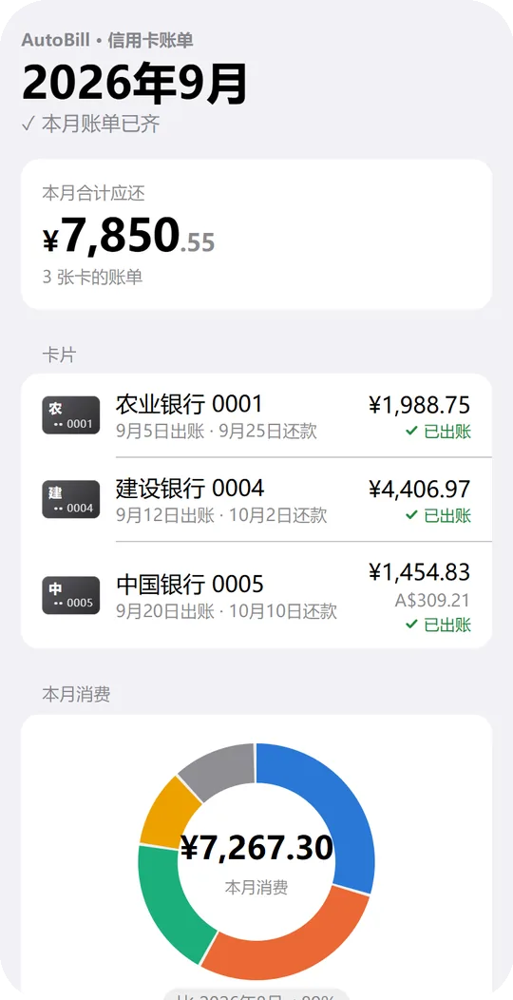
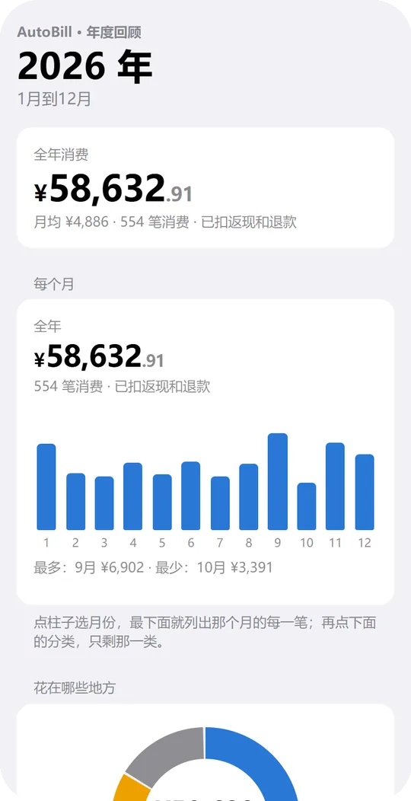
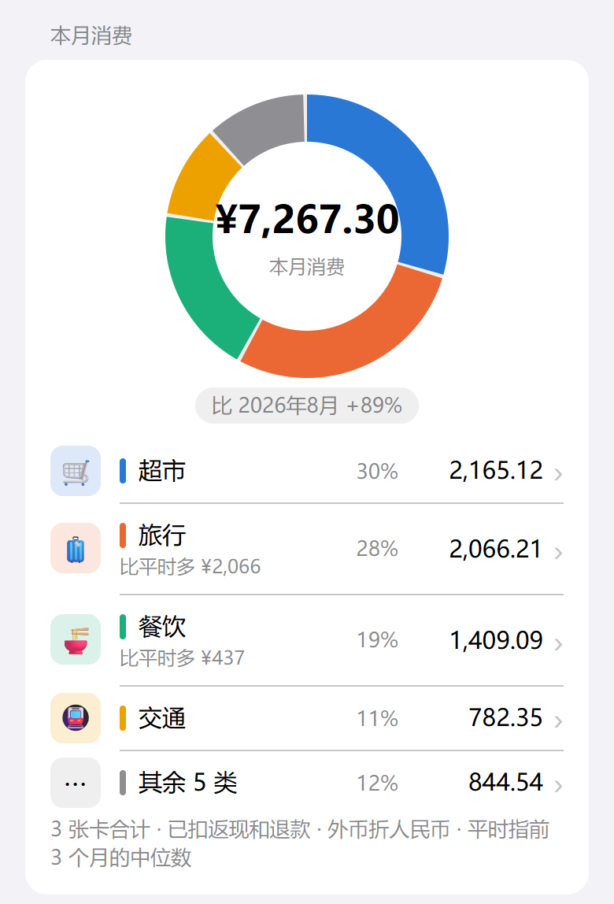
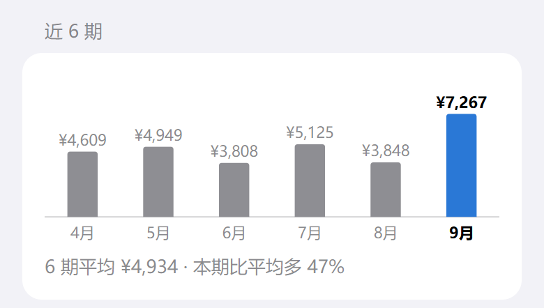
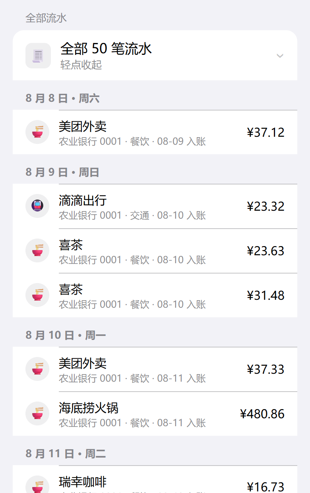
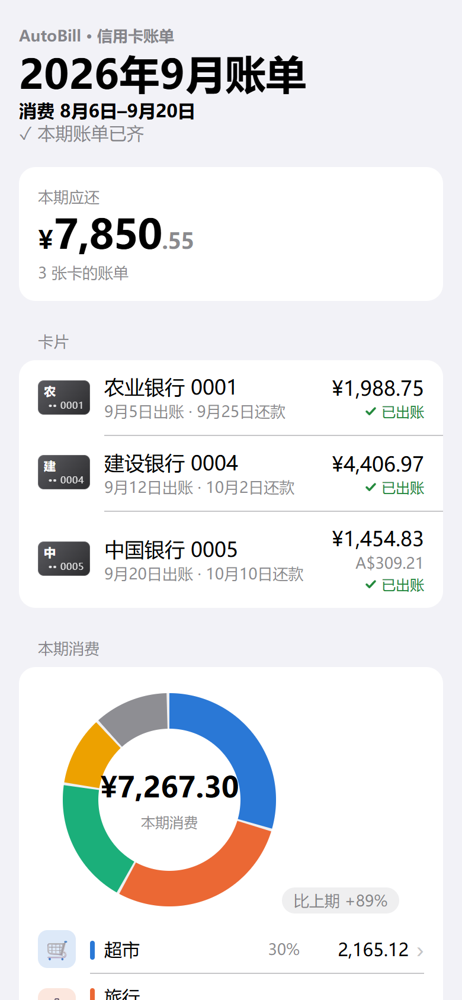
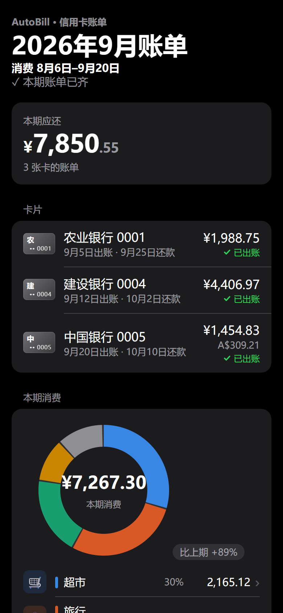
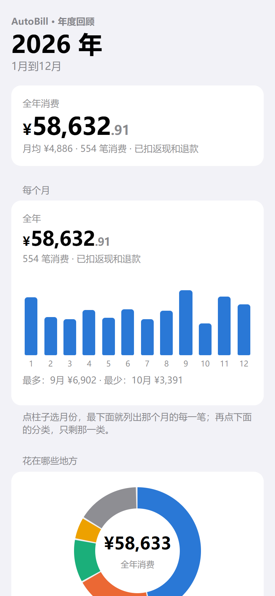
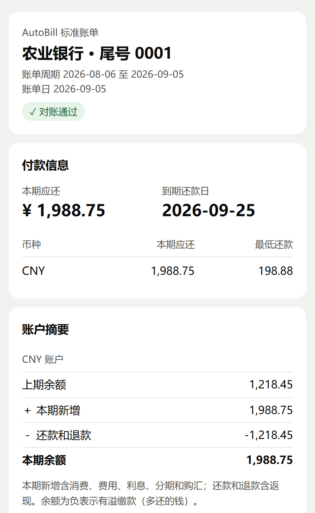

<!-- 图片来自 scripts/readme_art.py（横幅、流程图）和 scripts/demo_screenshots.py（动画、截图），
     数据全部是编的。见 docs/development.md。 -->
<picture>
  <source media="(prefers-color-scheme: dark)" srcset="docs/images/banner-dark.zh.svg">
  
</picture>

<p align="center">
  <a href="https://github.com/YangMingUNSW/autobill/actions/workflows/ci.yml"></a>
  <a href="https://github.com/YangMingUNSW/autobill/actions/workflows/docker.yml"></a>
  <a href="https://github.com/YangMingUNSW/autobill/releases"></a>
  
  <a href="LICENSE"></a>
</p>

<p align="center"><a href="README.md">English</a> · <b>简体中文</b></p>

自部署的信用卡账单汇总工具。AutoBill 读取农行、建行、中行、工行发到专用邮箱的信用卡电子账单，用固定规则解析并逐项对账，每个账单月给你发一封汇总邮件，每年 1 月再发一封年度回顾，都为 iPhone 自带的邮件 App 排版。账单和数据库只在你自己的服务器上，对外发出去的那一点见[隐私](#隐私)。

<table>
  <tr>
    <td width="50%" align="center" valign="top">
      <picture>
        <source media="(prefers-color-scheme: dark)" srcset="docs/images/demo-month-dark.webp">
        
      </picture>
      <br><sub><b>月报</b> · 轻点分类，看这一类的每一笔</sub>
    </td>
    <td width="50%" align="center" valign="top">
      <picture>
        <source media="(prefers-color-scheme: dark)" srcset="docs/images/demo-year-dark.webp">
        
      </picture>
      <br><sub><b>年度回顾</b> · 先选分类，再选月份</sub>
    </td>
  </tr>
</table>

<p align="center"><sub>动画和截图使用编造的演示数据，不是任何人的真实账单。</sub></p>

> [!NOTE]
> **开发进度**：已经在日常使用，用 Docker 每 30 分钟运行一次。支持四家银行，每个账单月一封邮件，还有年度回顾、提醒邮件和可选的 AI 商户分类。最新版本是 `v0.2.0`，之后合并的改动见 [CHANGELOG](CHANGELOG.md)，路线见 [project.md](project.md#6-分期路线)。

## 目录
- [功能](#功能)
- [邮件里有什么](#邮件里有什么)
- [工作原理](#工作原理)
- [隐私](#隐私)
- [支持的银行](#支持的银行)
- [开始使用](#开始使用)
- [文档](#文档)
- [常见问题](#常见问题)
- [参与开发](#参与开发) · [Security](#security) · [致谢](#致谢) · [License](#license)

## 功能
- **确定性解析**：每份账单都用固定规则解析，不经过 AI；逐项和银行印在账单上的汇总数核对，对不上会明确告诉你差在哪。程序更新改了解析器之后，已经存下的账单会自动重新读一遍。
- **一个账单月一封邮件**：等这个月该出账的卡都出账了才发，不会每来一张卡就发一封。邮件是一期账单：标题下面写着这一期消费的日期，金额都说"本期"；年度回顾才按交易日期算每个月实际花了多少。
- **轻点看明细**：分类、花得最多的商户和全部流水都能在邮件里直接展开，年度回顾还能按月份和分类筛选。全部用 CSS 做，不用脚本、不从网上加载任何东西，所以苹果邮件里能用，下载过的邮件没网也能看。
- **多币种**：每笔保留原币种，按账单邮件当天的汇率（[Frankfurter](https://frankfurter.dev)）折算人民币。
- **分类**：先按关键词规则分；规则分不出来的商户，可以交给你自己配置的 AI 接口（只发商户名、地点和币种）。
- **邮箱只读**：不删信、不移动、不标已读。
- **提醒**：不认识的邮件、解析失败、新卡号、邮箱登录失败时发一封提醒，同一个问题只提醒一次。
- **备份**：每月的邮件附一份压缩的数据库。
- **年度回顾**：每年 1 月的账单把 12 月的消费带齐之后，发一封自然年（1 月 1 日到 12 月 31 日）的年度回顾，样子和月度邮件一样：每月一根柱子、分类、花得最多的商户、去得最多的店、用哪些货币消费、各张卡。随时可以用 `autobill year-review` 预览。

## 邮件里有什么
<table>
  <tr>
    <td width="50%" valign="top">
      
      <p><b>本期消费</b>：分类圆环图和比上期。明显偏离平时（前 3 期的中位数）的分类会标出"比平时多/少 ¥X"，只展示、不评判。轻点一个分类（或下面花得最多的商户），就能看到它背后的每一笔。</p>
    </td>
    <td width="50%" valign="top">
      
      <p><b>近 6 期</b>：每期账单一根柱子，上面写着金额，本期高亮，附平均值。</p>
      
      <p><b>全部流水</b>：所有卡的流水合在一张表里，按日期分组，默认折叠、轻点展开；外币消费以当地币种为主，附折合人民币。</p>
    </td>
  </tr>
</table>

邮件一开头是本期应还和这一期消费的日期，以及每张卡的出账日、还款日和应还金额（外币卡同时给出原币种），最后是花得最多的商户。只展示还款日，不做还款提醒。

<details>
<summary><b>更多截图</b>：首屏的浅色和深色、年度回顾、标准账单</summary>
<br>
<p align="center">
  
  &nbsp;
  
  &nbsp;
  
</p>
<p align="center"></p>
<p align="center"><sub>可选命令 <code>autobill statement</code> 把每份账单生成统一格式的 HTML 和 PDF。</sub></p>
</details>

## 工作原理
<picture>
  <source media="(prefers-color-scheme: dark)" srcset="docs/images/pipeline-dark.zh.svg">
  
</picture>

AutoBill 每 30 分钟读一次邮箱文件夹里的新账单，解析、对账后存进 SQLite。一个月该出账的卡都出账了（或者最慢那张卡的账单日过了一周），就发这个月的邮件；之后才到的账单再补发一封（没有消费、也不用还钱的不补发），和同月的邮件折叠在同一个对话里。

## 隐私
- **邮箱只读**：用 `EXAMINE` 打开文件夹、用 `BODY.PEEK[]` 取信，不删、不移动、不标已读。
- **数据留在你的服务器上**：账单和 SQLite 数据库都在数据目录里。离开服务器的只有发到你自己邮箱的邮件，每月那封附一份数据库备份。
- **对外连接很少**：你自己的 IMAP 和 SMTP 服务器；[Frankfurter](https://frankfurter.dev)，只收到币种和日期；以及你配置了才会用的 AI 接口，只收到商户名、地点和币种，不含金额、日期和卡号。
- **邮件不加载任何东西**：没有外部图片、没有追踪像素、没有脚本。

完整的安全说明见 [SECURITY.md](SECURITY.md)。

## 支持的银行
| 银行 | 账单格式 | 状态 |
|---|---|---|
| 中国农业银行 | HTML 邮件 | ✅ 已支持 |
| 中国建设银行 | HTML 邮件 | ✅ 已支持 |
| 中国银行 | PDF 附件 | ✅ 已支持（含多卡合并账单） |
| 中国工商银行 | HTML 邮件 | ✅ 已支持（含一个账户多个币种） |

## 开始使用
### Docker
服务器上只需要 Docker：

```bash
mkdir -p autobill/data && cd autobill
curl -fsSLO https://raw.githubusercontent.com/YangMingUNSW/autobill/main/compose.yaml
curl -fsSL https://raw.githubusercontent.com/YangMingUNSW/autobill/main/config.example.yaml -o data/config.yaml
curl -fsSL https://raw.githubusercontent.com/YangMingUNSW/autobill/main/autobill.env.example -o autobill.env
chmod 600 autobill.env                  # 这个文件要放邮箱密码，只让自己能读
printf "AUTOBILL_UID=%s\nAUTOBILL_GID=%s\n" "$(id -u)" "$(id -g)" > .env   # 容器以你的身份运行
# 填好 data/config.yaml 和 autobill.env（邮箱密码），然后：
docker compose run --rm autobill check-mailbox   # 检查能不能登录邮箱
docker compose up -d                             # 启动：每 30 分钟运行一次
```

镜像发布在 `ghcr.io/yangmingunsw/autobill`，支持 `linux/amd64` 和 `linux/arm64`，云服务器、NAS、苹果芯片的 Mac 都能跑。完整步骤、邮箱设置和日常命令见 [docs/deploy.md](docs/deploy.md) 和 [docs/setup.md](docs/setup.md)。

### 本地试用（不需要邮箱）
需要 [uv](https://docs.astral.sh/uv/) 和 Git，使用仓库自带的脱敏样本：

```bash
git clone https://github.com/YangMingUNSW/autobill.git
cd autobill
export AUTOBILL_DATA_DIR=/tmp/autobill-dev             # 临时的数据目录
uv run autobill import-dir tests/fixtures --no-send    # 导入样本
uv run autobill preview-email --cycle 2026-09          # 把 9 月的邮件生成 HTML 文件
uv run autobill report --month 2026-08                 # 8 月的汇总
uv run autobill year-review --year 2026                # 今年到目前为止，文字版
```

Windows 的 PowerShell 里，把第三行换成 `$env:AUTOBILL_DATA_DIR = "$env:TEMP\autobill-dev"`。

## 文档
| 路径 | 内容 |
|---|---|
| [project.md](project.md) | 总览、第一版范围、已定决策、架构、风险 |
| [docs/](docs/README.md) | 各模块设计、各家银行的账单格式规格、开发流程、操作手册 |
| [tests/fixtures/](tests/fixtures/README.md) | 作者本人的真实账单，已脱敏（只去掉了身份信息） |
| [CHANGELOG.md](CHANGELOG.md) | 版本变更记录 |
| [CLAUDE.md](CLAUDE.md) | 给 AI 编程助手看的项目规则 |

设计文档用简体中文；代码、注释和 commit message 用英文。

## 常见问题
<details>
<summary><b>为什么用邮件，不做 App？</b></summary>

邮件会自己送到，永久存在邮箱里，什么都不用装，下载过没网也能看。苹果邮件和 Safari 用的是同一个内核，所以能做出 iOS App 的样子和手感。在中国大陆也照样能用：收信、发信都是服务器做的，手机只要能收邮件就行（iCloud 邮件在大陆可以正常收发）。
</details>

<details>
<summary><b>Gmail、Outlook 里能看吗？</b></summary>

邮件只为 iPhone 上的苹果邮件设计，也只在那里测试过。别的邮件客户端可能会丢掉样式，或者点不开折叠的部分。
</details>

<details>
<summary><b>支持我的银行吗？</b></summary>

目前支持农业银行、建设银行、中国银行和工商银行。每家银行的账单格式写在 [docs/banks/](docs/banks/README.md)，加一家新银行需要几份脱敏后的样本账单。请先开一个 issue，千万不要附上真实账单。
</details>

<details>
<summary><b>AI 能看到什么？</b></summary>

默认什么都看不到，你配置了接口才会用。用的时候，它只收到关键词规则分不出来的那些商户的名字、地点和币种；看不到金额、日期和卡号，也从来不用来解析账单或计算金额。
</details>

<details>
<summary><b>服务器没了怎么办？</b></summary>

每月的邮件都附一份压缩的数据库，你的邮箱就是异地备份。怎么还原见 [docs/deploy.md](docs/deploy.md)。
</details>

## 参与开发
欢迎提 Issue 和 Pull Request。请先读 [CONTRIBUTING.md](CONTRIBUTING.md)（开发流程和测试规范在 [docs/development.md](docs/development.md)）；参与的每个人都要遵守[行为准则](CODE_OF_CONDUCT.md)。

## Security
Please report vulnerabilities privately as described in [SECURITY.md](SECURITY.md). Do not open a public issue.

## 致谢
- [Frankfurter](https://frankfurter.dev)：免费的汇率接口，数据来自欧洲央行的参考汇率。
- [pdfplumber](https://github.com/jsvine/pdfplumber)、[Beautiful Soup](https://www.crummy.com/software/BeautifulSoup/)、[lxml](https://lxml.de)：用来读账单。
- [Jinja](https://jinja.palletsprojects.com)、[Typer](https://typer.tiangolo.com)、[Pydantic](https://docs.pydantic.dev)、[uv](https://docs.astral.sh/uv/)。
- 苹果的[人机界面指南](https://developer.apple.com/design/human-interface-guidelines/)：邮件的样子和手感以它为目标。

## License
[MIT](LICENSE) © Larry Row
